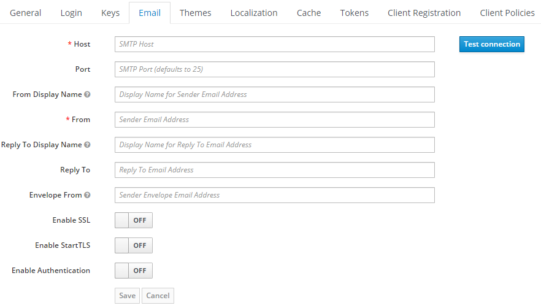
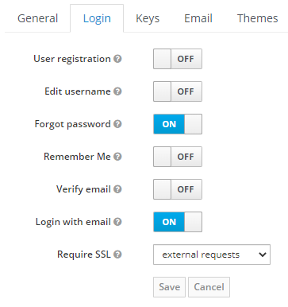

# Email

You can send emails to the users with Keycloak by just making a simple configuration, 
in this case the sent emails are use for forgot password protocol only. 
Here is the explanation of the requirements needed for doing that and also how to enable 
the forgot password protocol for users in the Evoke realm.

## Configuration

In order to configure the email attributes for Keycloak **first sign in to the administration console**,
then select the realm of Evoke, then browse in the left side bar the section called **Realm Settings**, once there it should appear multiple tabs for the configuration of the realm, 
the one we are interested in is the **Email** tab, click and it should appear the following form.

Here the required fields are:
- **Host**:
- **Port**:
- **From Display Name**:
- **From**:
- **Enable TLS**:
- **Enable Authentication**:
- **Username**:
- **Password**:

## Enable forgot password

