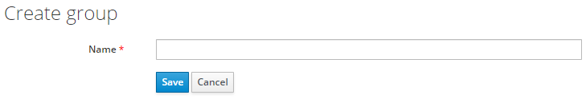
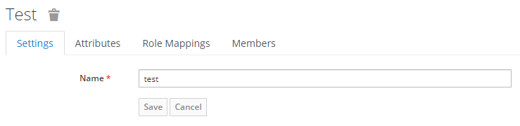
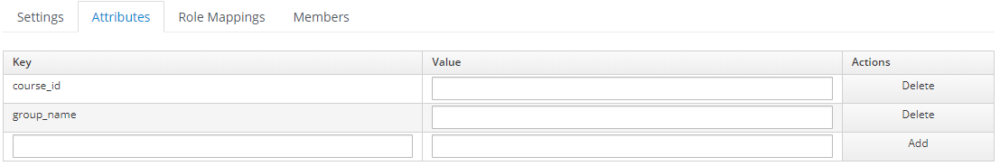

# Groups

The groups in Keycloak are the teams in which Evoke agents are members, 
Keycloak allows the possibility of creating a group and assign members in it. 

## Add groups

In order to create a group for the Evoke client **first sign in to the administration console**,
then select the realm of Evoke, then browse in the left side bar the section called **Groups**, 
once there it should appear magnifying glass button, click and it will filter the list of all the 
groups created for Evoke realm.

Search for the button that says **New** and in there it should appear the following form.

Type the name of the group that you want to add and click the button **Save**.

### Attributes

Evoke groups have attributes. Attributes are used in order to configure the required data
of the groups so they can be seen in the Evoke Platform with their respective course in 
which belongs to.

To add the required attributes, after you created a group or when you select a group
from the group list and click the button **Edit**, it should appear the following page.

Click on the tab **Attributes**, in order to add an attribute just click the button **Add** 
and add the following data: 
- **course_id:** The unique id of the course in which the group belongs.
- **group_name:** This attribute must have the same name of the group you added earlier, otherwise
it won't work.

After the attributes are added, click the button **Save** and group should be configured.

