# Themes

Keycloak permits to customize the default login themes for the realms, in this
case Evoke has its own login theme and other customized assets. Here it is
going to be explained how does themes works, how to customize theme and how
to implement them for the Evoke realm.

## Creation

First of all, in the Keycloak libraries where the Keycloak server
is installed, there is a folder called **themes**, there it should appear
the themes that keycloak currently has.

**Important**: Evoke has the Quarkus version of Keycloak, so the theme
folder won't have the base default themes libraries. Only the WildFly version has that
folder with its base files so we can obtain the configuration from them and apply it
to the current version we are working.

In order to create a new theme, just create a new folder inside the themes folder
with any name, for this case it is called **evoke-theme**. Before to start customizing the themes
it is important to know the types of themes that Keycloak supports, those types are:

- Account
- Admin
- Email
- Login
- Welcome

For the Evoke theme only, it is just required to work with the Email and Login theme types.

### File organization

Here is the structure of the themes that Evoke currently has.

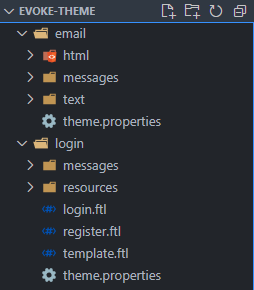

Each theme type must have a **theme.properties** file inside its folder, in this case Login
and Email theme folder. In that file is going to be the most important configuration and 
without it we won't be able to use the theme for the Evoke client in Keycloak. 

#### Login theme

Inside the file **theme.properties**, this is the code that is required to have
the theme type of the login theme for Evoke.

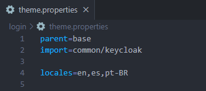

Here a description of the properties shown above.
- **parent**: It is required to use the base theme.
- **import**: The common/keycloak is to define that is going to be used the assets from 
the original keycloak theme.
- **locales**: Are the languages that the login theme is going to be able to be shown:
English, Spanish, and Portuguese (Brazil).

**Important!**: For the login theme only, it is also required to have all of the same code
from the theme.properties file from the original keycloak code obtained from the libraries
provided by the WildFly version of Keycloak. Exactly the code selected from the image below
and paste it on the theme properties for the Evoke login theme. 

*Note: It is also obtainable by making a search in the web for these code if neccesary.*

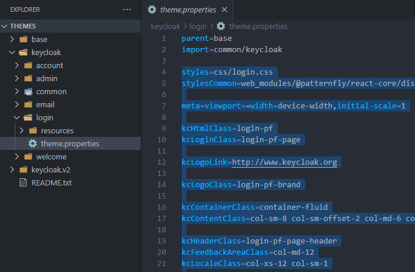

#### Email theme

Inside the file theme.properties, this is the code that is required to have the theme type of the
email theme for Evoke.

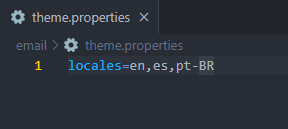

Here a description of the properties shown above.
- **locales**: Are the languages that the email theme is going to be able to be shown:
English, Spanish, and Portuguese (Brazil). 

### Messages and Resources

It is also required to create a **resources** and **messages** folder inside of each of the
theme types. Resources is going to be the place in which is going to be stored the **css** 
files and **images** if neccessary. 

Messages in order to store the languages in which themes are going to be able to display.
Evoke is localized for English, Spanish and Portuguese (Brazil).

### Apply theme to Evoke client in Keycloak

In order to apply a theme for a realm in Keycloak, in this case for Evoke 
**first sign in to the administration console**, select the Evoke Realm and then 
browse in the left side bar the section called **Realm Settings**. 
Here select the **Themes** tab.

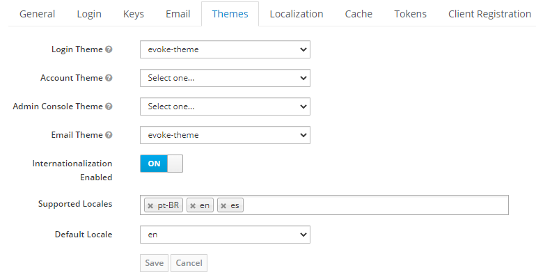

Evoke just needs the login and email theme, click on the dropdowns of each of these fields
and select the Evoke theme. Enable the internationalization slide button so the themes 
will be able to support multple languages. Select the supported locales and then the default
locale, for this case the english language. Click on save and now all changes will be displayed.

## Customization

So in order to customize the evoke theme, first there are three types of files to consider: FTL files,
CSS, and the Messages Files. FTL file is a template used by FreeMarker, it is the structure of the
pages build with HTML, it is important to know this if in the future it is needed to create new
fields to the login forms or other pages. CSS files are for customize the elements of those FTL files
like colors and other assets. Messages files are .properties files, in there all of our languages
localizations for the pages are stored, every element inside each of the FTL files has unique identificators
that helps us to later import to the messages files so we can change the language of a button, text or field.

### FTL

First, in order to customize the FTL, we need the keycloak FTL template so we can have the same structure
that keycloak login theme uses for the administration console for example, those templates are located
in the themes folder, then base theme inside the keycloak libraries.

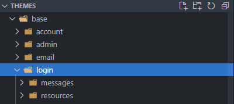

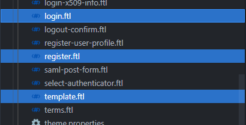

**Important!:**That file can be obtainable by searching for it in the original keycloak themes libraries and
pass it to our evoke theme. It is also required the login.ftl and register.ftl file.

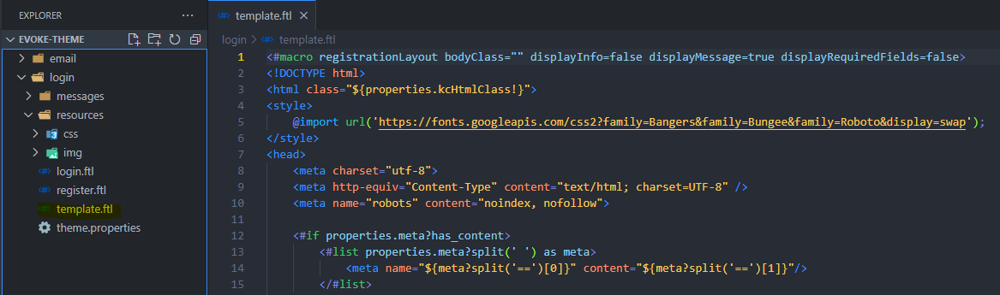

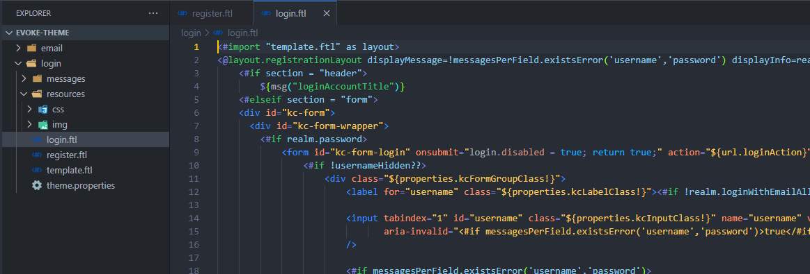

That is all what is needed to start customizing the theme in the css files, we

### CSS and Images

Inside the folder **resources**, if it is not yet created, create one
and there are going to be store all css files and images if neccesary by separate folders.

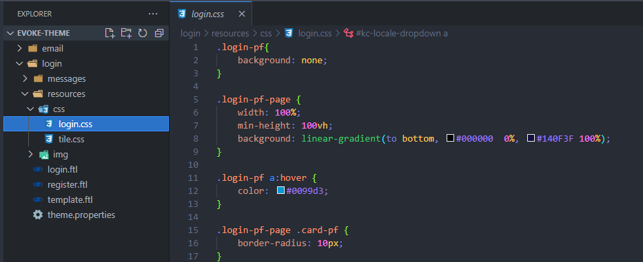

As it is shown above, there are all of the elements that are already customized for the Evoke
theme, all of those elements are located in the FTL files and are just required to be import here in this
css file so it can be customized.

**Important!** It is obtainable the css file template of the login theme that keycloak uses for its
administration console login for example so it should be easier the work to understand how to interact
with the css file.

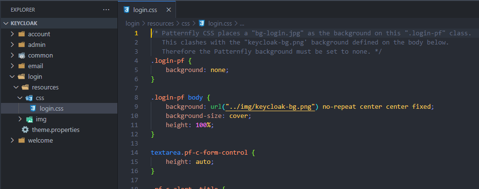

In this css file it can added images and all kinds of customization needed for the Evoke theme. 

### Messages

Messages are the files in which are located the localization of the theme. They can be obtainable by taking
the messages files from the base keycloak theme like in the image shown below.

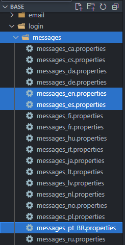

There are just required to look for the id of an element and by adding the desired translation to that element
like for the login theme of Evoke or its email message for password reset protocol.