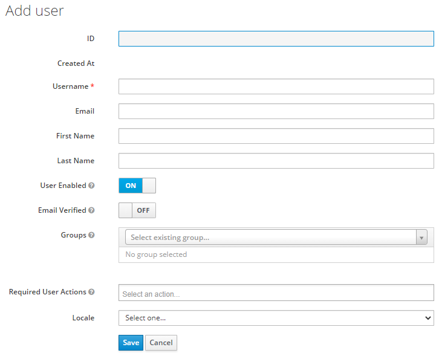
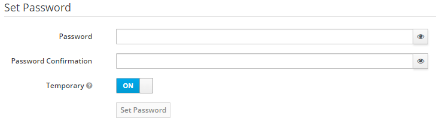
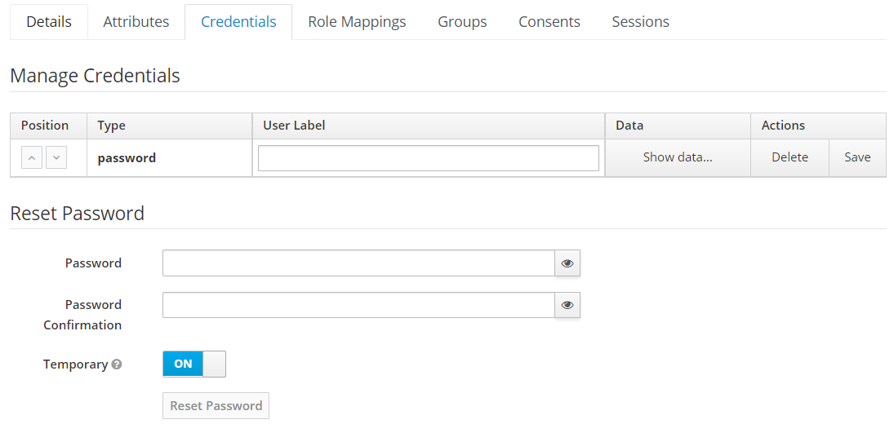
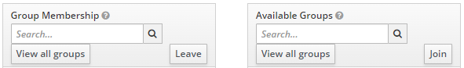
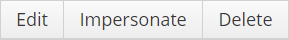
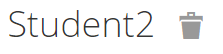

# Users

Evoke users are created and managed with the open source platform called Keycloak.
This section will explain how to use the administrator console in order to
know the important aspects and features in order to manage the users' data for the Evoke platform.

## Add users

In order to create users for the Evoke client **first sign in to the administration console**,
then select the realm of Evoke in order to manage the users' data, then browse in 
the left side bar the section called **Users**, once there it should appear magnifying glass button, 
click and it will filter the list of all the users created for Evoke realm.

Search for the button that says **Add user** and in there it should appear the following form.

Here are the fields that are required for the Evoke client in order to create a user:
- **ID:** Is the auto-generated key provided by Keycloak. It is important because it is the unique identification for 
each created user.
- **Username:** The name for the account. It can't have the same name of other account name, it is required to be unique.
- **Email:** It can be registered any type of email.
- **First Name:** It can be repeated.
- **Last Name:** It can be repeated.
- **User enabled:** A disabled user cannot login.
- **Email verified:** Verify the email in order to apply other features.
- **Groups:** You can add the user to a group just by typing on the selected the field the name of that group
and click it.

Once the fields are filled, Keycloak will redirect to the User's detail that has been created, 
at this point it is required to add credentials for the user so it can access to the Evoke
platform once the user wants to sign in for the first time. 

**Important!** The user will not appear in the participants list (the users) inside Evoke unless the user
sign in for the first time. 

### Password

Now with the user created, Keycloak will redirect to user detail page in which there are some features pending to
be configured at this point. Inside this page, head to the **Credentials** tab, there it is required to create 
a password for the user so it can sign in.

Fill the fields **Password** and **Password Confirmation**, you can set it to be a temporary password, meaning that
the user once it logout, the last password they used won't work for login again. For the Evoke platform, disable that 
option. Click on the button **Set password** and with that the user is able to sign in. 

## Edit users

In order to edit users, head to the users' list by browsing in the left side bar the section 
called "Users" in the admin console as explained in the previous section.

### User Details

Search for the user you want to edit by using the search box, once the user is found Keycloak can redirect to the user's 
detail by clicking ID highlighted in blue or by clicking the **Edit** button. Now with user found it should appear all 
the user's detail like the following: ID, Username, Email, First Name, Last Name, User enabled field and Email verified field.

**Important!** It is not allowed to change **Username** nor **ID**.

Any changes made in this page, should be **Saved** or **Cancel** by clicking the buttons below the fields
of the user's detail. 

### Reset Password

In order to change the user's credentials, in the same page of the user's detail search for the tab called **Credentials**
and click it. Once inside this page, it can be verified if this user has credentials by looking in **Manage Credentials** 
section it appears an attribute called **password**, that means that this user has already a password. Keycloak allows the 
possibility of delete it if neccesary.

Now to reset password it is just required to fill the fields **Password** and **Password Confirmation**, disable the 
**Temporary** slide button if it is enabled and click on the **Reset Password** button.

### Update user groups

In order to change the user's credentials, in the same page of the user's detail search for the tab called **Groups**
and click it, there it should appear two boxes, **Group membership** and **Available Groups**. 

- **Group membership**: Groups where the user is currently joined, in order to take out a user from a group it is just
required to search for the name of the group, can be done by typing the name of the group inside the search box or
scrolling down the list below. Once the group is found it is just required to click the **Leave** button.

- **Available Groups**: Groups where the user has not yet joined and are available, in order to join a user to a 
group it is just required to search for the name of the group, can be done by typing the name of the group inside the 
search box or scrolling down the list below. Once the group is found it is just required to click the **Join** button.

## Delete users

In order to delete users, head to the users' list by browsing in the left side bar the section 
called "Users" in the admin console as explained in the previous section.

Search for the user you want to delete by using the search box if wanted, search in the list and then
just click the **Delete** button. 

**Tip!** It is able to delete a user in its detail information page, at the side of its name appears
an icon that by clicking it does that.

